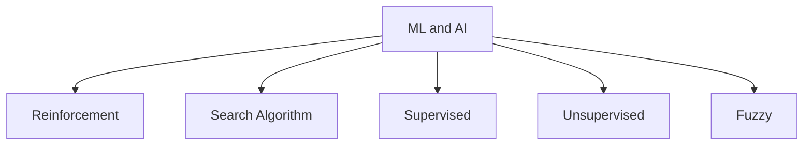

# Machine Learning and AI Examples

Please click on the box above to go to each folder

## References:  
[1] Deep Learning with Python - Chollet, Francois  
[2] [Link to comparison between logistic regression and perceptron](https://stats.stackexchange.com/questions/162257/whats-the-difference-between-logistic-regression-and-perceptron)  
[3] [Connectionist Models in Cognitive Psychology](https://stanford.edu/~jlmcc/papers/McCCleeremans09CnxMdlsOCC.pdf)  
[4] https://stats.stackexchange.com/a/418814/142439  
[5] https://aws.amazon.com/what-is/overfitting/  
[6] [Application of convolution](https://dspillustrations.com/pages/posts/misc/the-convolution-theorem-and-application-examples.html)  
[7] https://www.deeplearningbook.org/  
[8] http://cs231n.stanford.edu/  
[9] http://neuralnetworksanddeeplearning.com/chap5.html  
[10] https://www.deeplearningbook.org/contents/convnets.html  
[11] https://stanford.edu/~shervine/teaching/cs-230/cheatsheet-recurrent-neural-networks  
[12] https://youtu.be/oymtGlGdT-k?t=1010  

