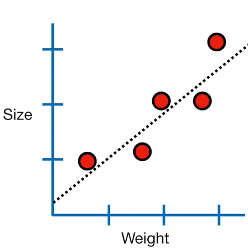
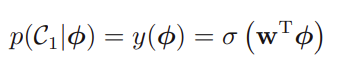
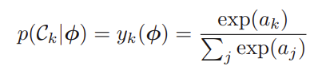
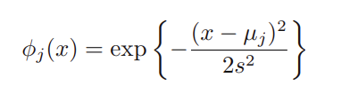
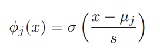
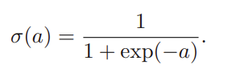
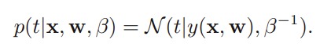
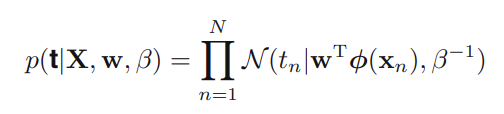

# Linear Regression

  

In linear regression, we want to find a line to fit the direction of the data points.

# Logistic Regression
Logistic regression predict or classify true or false instead of drawing a line to predict continuous trend in linear regression. It use propability. The logistic regression model predicts the class label of a sample by first computing the dot product of the feature vector and the weight vector. 

  

Although LR is known for binary classification, we can also expand it to multiple class by using softmax function instead of sigmoid.

  

# Basis function
We have function f
$$f(x) = w_0 \times 1 + w_1 \times x + w_2 \times x^2 + w_3 \times x^3 + \ldots$$

After being simplified,F has the form of:
$$y(x, w) = w_0 + \sum_{j=1}^{M-1} w_j \phi_j(x)$$

And $\phi_j(x)$ is the basis function

We have three commons basis functions:
1. Gaussian basis function

  

2. Signmoidal basis function

  

3. Logistic sigmoid function

  

4. or `tanh(a)=2σ(a) − 1`

## Cost Function

# Likelihood function
Most of the formulas are obtained from the book of Bishop. If you want to learn more you can read the link below. I will try to break down each equation so we can understand it.

  

  

# Q & A
1. why do we take square error in cost function?  
	- beside mean square error we also have mean absolute error. Mean square error is easier to take derivative and it amplifies errors.
2. why do we have 1/2 in cost function?
	- as many physic models, we often add a term to make our calculation easier later. That is the reason we have 1/2 in the cost function.
3. We are introduce noise in the deterministic function y(x,w), so why ϵ is defined as "zero mean Gaussian random variable with precision (inverse variance) $\beta$". What does it mean?
    -  *zero-mean*: gaussian distribution is centered at zero. It can be plus or minus
    -  *Precision*: variance the the width in gaussian distribution; therefore, the inverse of it will be precision
    -  
	
**Good References**  
https://stats.stackexchange.com/a/393245/142439  
https://www.microsoft.com/en-us/research/uploads/prod/2006/01/Bishop-Pattern-Recognition-and-Machine-Learning-2006.pdf

	
